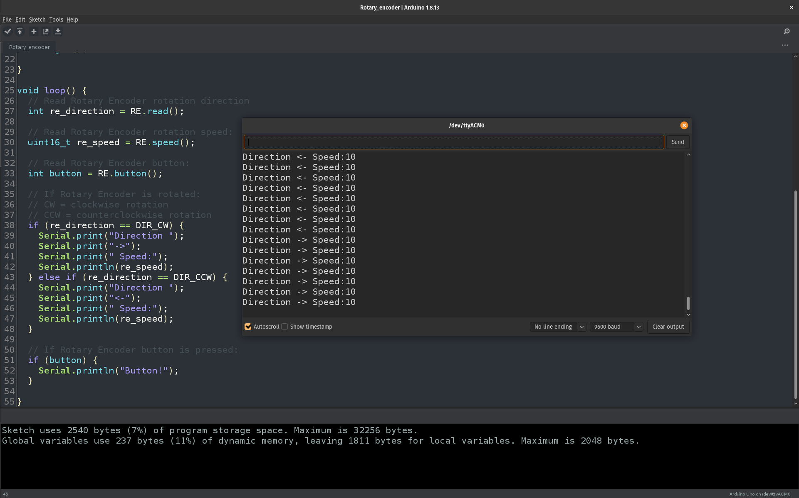

# Tauno Rotary Encoder library

- Counts half a steps
- Returns rotation direction
- Returns rotation speed

## Example code

```c++
#include <Tauno_rotary_encoder.h> // Include Rotary Encoder library

// Define Rotary Encoder pins
const int RE_SW_PIN  = 2;
const int RE_CLK_PIN = 6;
const int RE_DT_PIN  = 5;

Tauno_Rotary_Encoder RE(RE_SW_PIN, RE_CLK_PIN, RE_DT_PIN);

void setup() {
  // Start Serial
  Serial.begin(9600);

  // Start Rotary Encoder
  RE.begin();

}

void loop() {
  // Read Rotary Encoder rotation direction
  int re_direction = RE.read();
  
  // Read Rotary Encoder rotation speed:
  uint16_t re_speed = RE.speed();
  
  // Read Rotary Encoder button:
  int button = RE.button();
  
  // If Rotary Encoder is rotated:
  // CW = clockwise rotation
  // CCW = counterclockwise rotation
  if (re_direction == DIR_CW) {
    Serial.print("Direction ");
    Serial.print("->");
    Serial.print(" Speed:");
    Serial.println(re_speed);
  } else if (re_direction == DIR_CCW) {
    Serial.print("Direction ");
    Serial.print("<-");
    Serial.print(" Speed:");
    Serial.println(re_speed);
  }

  // If Rotary Encoder button is pressed:
  if (button) {
    Serial.println("Button!");
  }

}
```

## Screenshot


